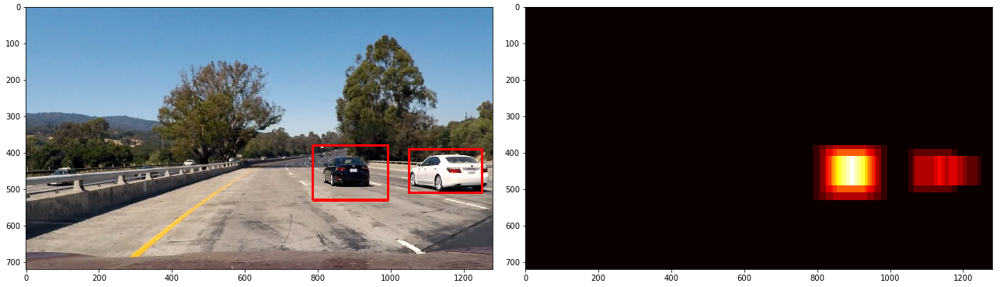

# **Vehicle-detection-and-Tracking**

### **Project Overview**

This project contains the results from completing Project 5 of the Udacity Self-Driving Car Engineer Nanodegree. The goal of the project is to build an object detector that detects and tracks cars in a video stream. Feature descriptor called a Histogram of Oriented Gradients (HOG), which is a handy way of simplifying and extracting useful features from an image, and combine it with a machine learning classifier, specifically the Multi-layer Perceptron Classifier.

#### Files in the repository
* The [Project Notebook](project_notebook.ipynb)
* A [Project Writeup](WRITEUP.md)

#### Running the code
This project was developed using Python 3.5. The project depends on the NumPy, OpenCV, Scikit Learn, Scikit Image, Matplotlib & MoviePy libraries.
